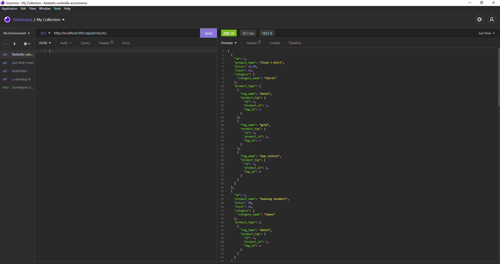

# Fantastic Umbrella E-commerce Back End

[Fantastic Umbrella E-commerce Back End Walkthrough Video](https://www.youtube.com/watch?v=Iou1PhDjYVY&ab_channel=ZichKoding)
[](https://www.youtube.com/watch?v=Iou1PhDjYVY&ab_channel=ZichKoding)

## _Table of Contents_
* Description
* How to Use
    * [GET all](#GET-all)
    * [GET by id](#GET-by-id)
    * [POST](#POST)
    * [PUT](#PUT)
    * [DELETE](#DELETE)

## **Description**
The _Fantastic Umbrella E-commerce API_! With this application you can create, update, and delete producsts, categories, and tags. The `/api/products` will show a JSON output of `product_name, price, stock, category_id, and associated tags`. The `/api/categories` will show a JSON output of `category_name`, and associated `product_name`. The `/api/tags` will show a JSON output of `tag_name`, and associated `product_name`.

## **How to Use**
## GET all:
* `api/products` will GET all products and associated data.
* `api/categories` will GET all categories and associated data.
* `api/tags` will GET all tags and associated data.

## GET by id:
* `api/products/:id` will GET the product based off the id parameter at the end of the route. This will return the category and tags associated with this product.
* `api/categories/:id` will GET the category based off the id parameter at the end of the route. This will return the products associated with this category.
* `api/tags/:id` will GET the tag based off the id parameter at the end of the route. This will return the products associated with this tag.

## POST:
* `api/products/` will create a new prouct. The formatting of creating a new product is the following:
    ```
    {
        "product_name": "Your product name goes here",
        "price": enter the price here, ex. 5.99,
        "stock": enter the amount of stock here, ex. 10,
        "category_id": enter the category id here.,
        "tagIds: enter tag ids inside brackets seperated by commas, ex. [1, 2, 3, 6]
    }
    ```
The `tagIds` are optional. 
* `api/categories/` will create a new category. The formatting of creating a new category is the following:
    ```
    {
        "category_name": "Your category name goes here"
    }
    ```
* `api/tags/` will create a new tag. The formatting of creating a new tag is the following:
    ```
    {
        "tag_name": "Your tag name goes here"
    }
    ```

## PUT:
* `api/products/:id` will update the product associated with the id that is given at the end of the url where `:id` is. The formatting of updating a product is the following:
    ```
    {
        "product_name": "Your product name goes here",
        "price": enter the price here, ex. 5.99,
        "stock": enter the amount of stock here, ex. 10,
        "category_id": enter the category id here.,
        "tagIds: enter tag ids inside brackets seperated by commas, ex. [1, 2, 3, 6]
    }
    ```
The `tagIds` are optional. 
* `api/categories/:id` will update the category associated with the id that is given at the end of the url where `:id` is. The formatting of updating a category is the following:
    ```
    {
        "category_name": "Your category name goes here"
    }
    ```
* `api/tags/:id` will update the tag associated with the id that is given at the end of the url where `:id` is. The formatting of updating a tag is the following:
    ```
    {
        "tag_name": "Your tag name goes here"
    }
    ```
## DELETE:
* `api/products/:id` will delete the product associated with the id that is given at the end of the url where `:id` is. 
* `api/categories/:id` will delete the category associated with the id that is given at the end of the url where `:id` is.
* `api/tags/:id` will delete the tag associated with the id that is given at the end of the url where `:id` is.